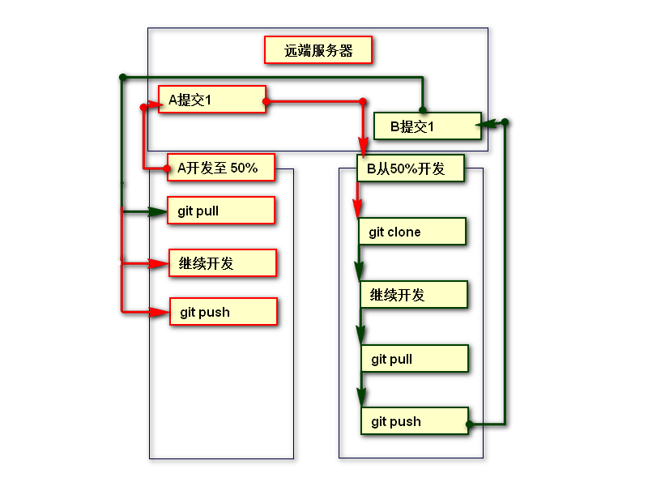

#### git远程(共享)仓库
通过之前的学习我们可以很好的管理本地版本控制了，可是如果我们下班回到家里突然来了灵感觉得有部分代码可以优化，如果能接着公司电脑上的代码继续写该有多好呀！
另一种情形，假设项目比较大，不同的功能模块由不同的开发人员完成，不同模块之间又难免会依赖关系，这时如果我们的代码互相合并（融合）该有多好呀！所有模块开发完毕后，需要整合到一起，要能做到准确无误该有多好呀！

借助一个远程仓库，大家可以共享代码、历史版本等数据，便可以解决以上遇到的所有问题，在学习远程仓库前我们先来学习 git clone path 这个命令。

####1.  创建共享仓库

+ Git 要求共享仓库是一个以 .git 结尾的目录
+ mkdir name.git 创建以.git结尾目录
+ cd name.git 进入这个目录
+ git init --bare 初始化一个共享仓库，也叫裸仓库 注意选项  --bare
```
Administrator@AAA MINGW64 ~/Desktop/github (master)
$ mkdir repo.git   ---> 创建了一个以.git结尾的目录
   
Administrator@AAA MINGW64 ~/Desktop/github (master)
$ cd repo.git/     --->切换到当前目录中
  
Administrator@AAA MINGW64 ~/Desktop/github/repo.git (master)
$ git init --bare  --->在本地电脑初始化了一个裸库

Initialized empty Git repository in C:/Users/Administrator/Desktop/github/repo.git/
``` 
**注意git init和git init --bare不同**
+ git init
是初始化了一个普通库，在工作目录下，除了.git目录外，你还可以看到库中包含的所有源文件。你可以对当前的本地库进行浏览和修改(add,commit,delete)等

+ git init --bare
是初始化了一个裸库，在工作目录下，只有一个.git目录，而没有类似于本地库那样的文件结构可以供你进行浏览和操作，裸库主要被创建为大家一起工作的共享库，每个人都可以往里面push自己的本地修改

  此时就建好了一个共享的仓库，但这时这个仓库是一个空的仓库，并且不允在这个仓库中进行任何修改。 查看repo.git 文件夹，发现它生成了几个配置文件
```
Administrator@AAA MINGW64 ~/Desktop/github/repo.git (BARE:master)
$ ls
config  description  HEAD  hooks/  info/  objects/  refs/
```

#### 2. 忽略清单文件
在项目开发中，会存在一部分配置文件和其他不需要分享的文件，如果你不想被别人拿到，就不要备份，让git忽略到这一部分的代码，那么就需要建立一个忽略清单文件

+ git 会自动检测 .gitignore 这个文件。
+ 这个文件中列出的文件夹，或者文件，可以被 git 忽略  
+  在这个忽略清单中的文件不会被备份到仓库中, 即使我们执行 git add /git commit 命令,也会被忽略!

1. 在项目根目录，新建新建一个名为 .gitignore 的文件
2. 将不需要被备份得文件添加到.gitignore 文件中
```
# 忽略项目根目录的test文件夹中的内容
/test

# 忽略项目中所有名为test的文件夹，或者文件
test

# 忽略项目中的名为app.js的文件
app.js

# 忽略项目中的所有js
*.js

/test/*.*
```


####3.  向共享仓库共享(同步)内容
将自已开发的项目同步到这个目录中，其它开发者就可以共享你开发的项目了。

1. 假设有一个项目文件夹 yeah ，进入到这个目录中
2. git push  ../repo.git master  将项目放进本地仓库 repo.git 中 
```
Administrator@AAA MINGW64 ~/Desktop/github (master)
$ cd yeah/

Administrator@AAA MINGW64 ~/Desktop/github/yeah (master)
$ git push ../repo.git/ master
```  
  
  这样就将 yeah 文件夹里的内容同步进了 repo.git 中
    

#### 4. 从共享仓库中取出内容
很重要的一点：当一个项目由2个及以上的人员共同开发时，会存在不同的分工和进度，那么在 push 之前你是不是应该知道你的小伙伴们的进度呢？
假设有 A 和 B 共同开发一个项目，A已经将完成了 50% 的进度放到了本地仓库中，因为任务紧急，现在需要 B 和 A 共同完成后面的开发
那么 B 需要：

+ git clone 目标文件  存放的文件夹
+ clone的文件默认存放在当前路径下 你自己设置的文件夹中
```
Administrator@AAA MINGW64 ~/Desktop/github (master)
$ mkdir example && cd example

Administrator@AAA MINGW64 ~/Desktop/github/example (master)
$ git clone ../repo.git/ demo

Administrator@AAA MINGW64 ~/Desktop/github/example (master)
$ ls demo/
css/ index.html js/
```  

通过 repo.git 共享仓库，我们轻松得到了一个 yeah 的副本，将仓库中的代码取到本地，你就可以进行接下来的开发了

</img>
**第一次获取文件时要 git clone ,在以后的开发中，每一次 git push 之前都需要先 git pull **
接下来如果文件有新的变动你只需要重复之前的动作就行了 

#### 5、通过 demo 向r epo.git 共享内容
进入到demo里，我们做一些修改,并将新创建的文件提交到 repo.git 仓库
+ cd demo
+ git push ../repo.git master

####6.  从  repo.git 仓库 中获取共享的内容
还记得我们一开始创建了一个 yeah 的文件夹吗？执行：
+ cd yeah
+ git  pull ../repo.git master

很神奇的是，我们轻松的将 demo 仓库里的 内容，通过 repo.git 共享到了 yeah 仓库

到目前为止，我们发现，我们的共享仓库只是放到了本地，其他人是没有办法从我们这个共享仓库分享内容的
那么，我们需要把这个共享仓库放到一台远程服务器上，问题就解决了！ 

