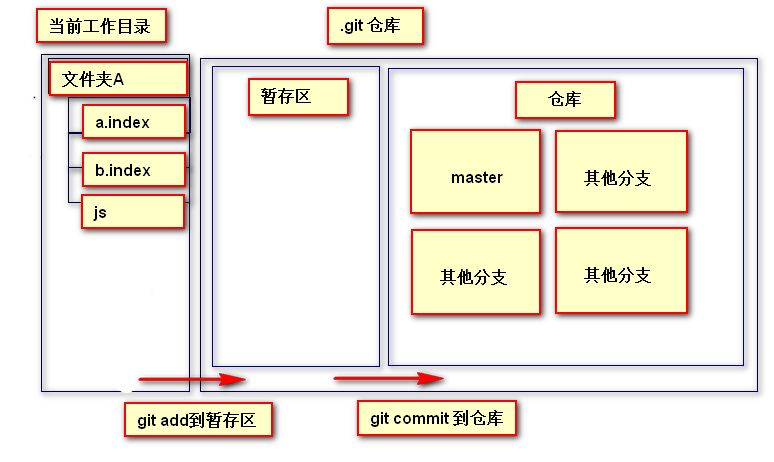

##  Git

#### 1. git安装
+ Window安装：
http://git-scm.com/download/win下载Git客户端软件，和普通软件安装方式一样。
+ Linux安装：
   CentOS发行版：sudo yum install git
  Ubuntu发行版：sudo apt-get install git
+ Mac安装：
打开Terminal直接输入git命令，会自动提示，按提示引导安装即可。

#### 2. git 工作原理

######  基本的Git工作流程如下：

1.  在工作目录中修改文件。
2.  暂存文件，将文件的快照放入暂存区域。
3.  提交文件，找到暂存区域的文件，将快照永久性存储到Git仓库目录。

###### 由此引入 Git 项目的3个工作区域的概念：

+ 工作目录
		工作目录是对项目的某个版本独立提取出来的内容。这些从Git仓库的压缩数据库中提取出来的文件，放在磁盘上供你使用或修改。
	
+  暂存区域
	暂存区域是一个文件，保存了下次将提交的文件列表信息，一般在Git仓库目录中。有时候也被称作“索引”（Index），不过一般说法还是叫暂存区域。
 
+ Git 仓库
	Git仓库目录是Git用来保存项目的元数据和对象数据库的地方。 这是Git 中最重要的部分，从其它计算机克隆仓库时，拷贝的就是这里的数据。
</img>

###### Git管理我们文件的4种状态：
为了更好的学习Git，我们们必须了解Git管理我们文件的4种状态：

+ 未追踪（untracked）
     文件已生成但未被添加到暂存区，也没有被提交过
+ 未修改（Unmodify）
     自上次提交后没有修改过代码
+ 已修改（modified）
     自上次提交后，文件有过修改
+ 已暂存（staged）
     文件已被添加到暂存区域

###### git本地仓库
Git本地仓库指的是开发者计算机中的仓库。

###### git基础
 
 命令行方式：任意目录（建议开发根目录）右键 > Git Bash Here

**1. 配置用户**
 配置用户的意义在于记录开发者信息，以便在版本控制中记录开发者的操作行为

```
    git config --global user.name "自已的名字"
    git config --global user.email "自已的邮箱地址"
```
 **--global 配置当前用户所有仓库**
**注**：配置用户只需要执行1次，可以重复使用。
             配置的用户信息会被保存到  **C:\Users\[用户名]\.gitconfig** 文件中

**2. 初始化仓库**
我们如果想要利用git进行版本控制，需要将现有项目初始化为一个仓库，或者将一个已有的使用git进行版本控制的仓库克隆到本地。
```
Administrator@AAA MINGW64 ~/Desktop/github/git (master)
$ git init
Initialized empty Git repository in C:/Users/Administrator/Desktop/github/git/.git/
```
git init会在当前项目目录中创建一个名为.git的隐藏目录，这个目录包含了**暂存区和仓库两个区域**，有了这个隐藏目录就可以使用git来管理项目了，通过 ls  -al 可以查看。
```
Administrator@AAA MINGW64 ~/Desktop/github/git (master)
$ ls -al
total 9
drwxr-xr-x 1 Administrator 197121 0 7月   5 22:09 ./
drwxr-xr-x 1 Administrator 197121 0 7月   5 22:07 ../
drwxr-xr-x 1 Administrator 197121 0 7月   5 22:09 .git/
```
我们可以看到当前目录下的所有文件

 **3. 查看文件状态**
初始化仓库后便可以进行开发了，进入到刚刚创建好并初始为仓库的目录，添加我们开发需要的文件。
+ git status 可以检测当前仓库文件的状态。
+ 状态1： Untracked(未追踪)
我在当前目录创建了一个 hello.txt文件和一个空的目录 hi
```
Administrator@AAA MINGW64 ~/Desktop/github/git (master)
$ git status
On branch master
Initial commit
Untracked files:  ----注：状态描述
(use'git add <file>...to include in what will be committed)
        hello.txt  ----注：红色字体
nothing added to commit but untracked files present (use "git add" to track)
```
此时 git 以红色字体提示  hello.txt 文件的状态是 Untracked(未追踪)，并且提示我们 “(use  "git add <file>..."  to include in what will be committed)”
另外我们发现：git 自动忽略了空目录 hi

**4. 添加文件到暂存区**
假设刚才添加的是我们的开发文件，需要把已开发的部分暂存起来等待提交，使用git add 添加到暂存区。
+ git add 文件名/文件路径   添加文件到暂存区
+ 或git add -A/ \*      添加当前目录的所有文件到暂存区
+ 执行 git add 命令是将文件从工作目录中提交到了暂存区
```
Administrator@AAA MINGW64 ~/Desktop/github/git (master)
$ git add -A
```
然后我们在查看一下文件状态： git  status
```
Administrator@AAA MINGW64 ~/Desktop/github/git (master)
$ git status
On branch master
Initial commit
Changes to be committed: ----注：提示信息
(use "git rm --cached <file>..." to unstage)
        new file:   hello.txt ----注：字体由红色变成了绿色
```
此时我们发现，文件处于被提交状态("Changes to be committed") ，并且被 git add到暂存区的文件 hello.txt 字体颜色也由红色变成了绿色
当然，git status 依然忽略了空目录 hi

**注意注意的是：git的每一次都只是将文件内容的改动部分进行添加，因此仓库中的文件备份远小于实际文件的体积**

**5. 撤销更改**
然后又经过一段时间后发现新开发的部分有Bug，想要回到之前状态，可以使用git checkout 文件名，将上次暂存的文件还原到工作区。
+ git checkout 文件名  将暂存区的文件还原到工作区
```
 Administrator@AAA MINGW64 ~/Desktop/github/git (master)
 $ git checkout index.html
```

**6. 提交文件**
经过一个相对较长阶段开发或者一个功能开发完成了，就可以提交到本地仓库了，永久保存了。
+ git commit -m '备注信息' 将暂存区的文件提交至仓库
+ \-m 后紧跟对本次提交的注释信息，为必需项
```
Administrator@AAA MINGW64 ~/Desktop/github/git1 (master)
$ git commit -m '将暂存区的文件提交至仓库'
[master (root-commit) 3cce0cd] 将暂存区的文件提交至仓库
1 file changed, 1 insertion(+)
create mode 100644 hello.txt
```
提交后我们对文件又进行了新的更改，此时 git status 一下
状态3：modified(已修改) 
```
Administrator@AAA MINGW64 ~/Desktop/github/git1 (master)
$ git status
On branch master
Changes not staged for commit:
(use "git add <file>..." to update what will be committed)
(use "git checkout -- <file>..." to discard changes in working directory)
        modified:   hello.txt ---->状态提示 红色字体
```
此时我们发现文件的状态是被标记成红色字体的  modified:  hello.txt
modified 状态用来标记在上一次 commit 之后文件发生过修改但是没有进行 add 提交，我们只需要将文件执行 add 和 commit 命令，将新修改的部分提交至仓库即可

**7. 查看提交历史**
反反复复开发了很多的功能了，通过git log查看一下提交的历史。
+ git log  查看提交历史记录
+ git reflog 查看所有的操作记录
+ git log --oneline  将提交记录在一行上显示，它默认只显示提交 id 和备注信息

```
Administrator@AAA MINGW64 ~/Desktop/github/git (master)
$ Administrator@AAA MINGW64 ~/Desktop/github/git (master)
commit fdd4fa8ce97efaf8b3ba3c713f5c174da5821e7b (HEAD -> master)
Author: ‘aaa <guo_dan@aliyun.com>
Date:   Thu Jul 6 00:47:03 2017 +0800
    a
commit 3cce0cdab9ddcfa9a51e2f9cc57b5e986166c864
Author: ‘aaa <guo_dan@aliyun.com>
Date:   Wed Jul 5 22:49:28 2017 +0800
    将暂存区的文件提交至仓库
```
我们看到 git log 命令很详细的查看到我的提交记录：
第一次提交的备注信息是 : 将暂存区的文件提交至仓库
第二次提交的备注信息是 :  a
我们最初建立 git 仓库时配置的用户名和邮箱信息：Author: ‘aaa <guo_dan@aliyun.com>
以及每一次 commit 到仓库时的 id ：3cce0cda······
 
但是当开发项目时会有太多的提交记录，查看起来很不方便，这时我们需要提交记录以简洁的形式展现出来：
执行 git log --oneline 
```
Administrator@AAA MINGW64 ~/Desktop/github/git (master)
$ git log --oneline
fdd4fa8 (HEAD -> master) a
3cce0cd 将暂存区的文件提交至仓库
```
此时我们只看到了两条提交记录，包含提交 id 和备注信息
**注意：每一次提交的 id 都是唯一的，只需要起始7个字符即可索引到该条提交记录**

我们在用 git status 查看一下：
```
Administrator@AAA MINGW64 ~/Desktop/github/git1 (master)
$ git status
On branch master
nothing to commit, working tree clean
```
发现分支上很干净，没有文件需要提交了

**10. 恢复之前提交的版本(时光倒流)**
在开发过程中，有的时候难免会需要返回到之前某一次的操作，即使没有月光宝盒，时光倒流一下也没有问题
+ git reset --hard  提交的id
+ git reset --head head 回到上一次提交记录
```
Administrator@AAA MINGW64 ~/Desktop/github/git (master)
$ git reset --hard 3cce0cd ---->第一次提交记录的id
HEAD is now at 3cce0cd 将暂存区的文件提交至仓库
Administrator@AAA MINGW64 ~/Desktop/github/git (master)
$ git log
commit 3cce0cdab9ddcfa9a51e2f9cc57b5e986166c864 (HEAD -> master)
Author: ‘aaa <guo_dan@aliyun.com>
Date:   Wed Jul 5 22:49:28 2017 +0800
    将暂存区的文件提交至仓库
```
我返回到了第一次的递交记录，然后  git log 查看一下，第二次提交的记录就不存在了。

好了，学习了那么多 git 命令，我们来回顾一下：

+ 配置用户：git config --global user.name "自已的名字"
                     git config --global user.email "自已的邮箱地址"
+ 初始化仓库：   git init 
+ 查看文件状态： git status (4种状态)
+ 添加文件到暂存区：  git add 文件名
+ 提交文件到仓库：      git commit -m'备注信息必须有'
+ 查看提交历史：   git log
+ 查看所有提交：   git reflog
+ 提交历史在一起显示： git log --oneline
+ 恢复以前提交的版本： git reset --hard commitID


