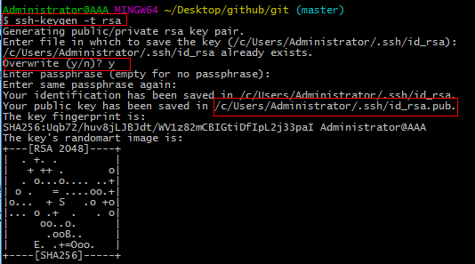
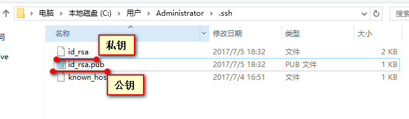
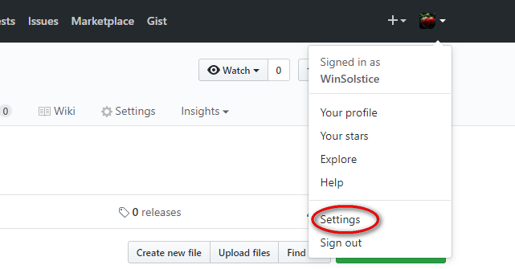
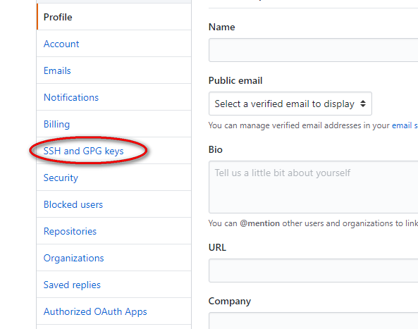
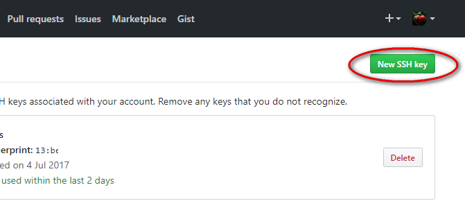
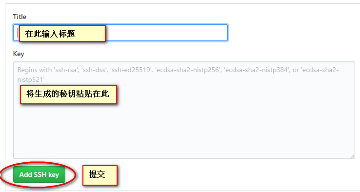

#### SSH 安全秘钥登录

工作中，我们常常需要将本地代码推送到远端服务器，或者从远端服务器获取任务进程，就需要频繁的登陆到远端服务器。使用 SSH Key 可以实现安全秘钥证书的方式登陆远端服务器，这样所有传输的数据都会被加密，数据传输的过程会更加安全，避免遭受恶意攻击。

常见有两种加密技术，分别是对称性加密和非对称性加密，SSH属于后者。
+ 对称加密算法在加密和解密时使用的是同一个密钥；
+ 而非对称加密算法需要两个密钥来进行加密和解密，这两个秘钥分别是公开密钥（public key，简称公钥）和私有密钥（private key，简称私钥）。

此处我们介绍非对称加密 SSH的用法
+ SSH是一种网络协议，用于计算机之间的加密登录。
+ SSH只是一种协议，存在多种实现，既有商业实现，也有开源实现。

公钥和私钥成对出现，都可以对数据进行加密。如果是以公钥进行的数据加密，只能与之相对应的私钥才可以解密，反之亦然。这样就可以提高信息传递的安全性。

```
格式：ssh user@host
user 代表真实存在的用户  host代表要登录的远程计算机
```


##### 工作原理

通过命令 ssh-keygen -t rsa  来创建秘钥，公钥和私钥是成对出现，公钥放在服务器上。
当需要连接到SSH服务器上，客户端软件(本地)就会向服务器(远端)发出请求，请求使用用户(本地)的密匙进行安全验证；
服务器(远端)收到请求之后，先在服务器上用户的主目录下找到该用户的公用密匙，然后把它和用户发送过来的公用密匙进行比较。
如果两个密匙一致，服务器就用公用密匙加密“质询”并把它发送给客户端软件。客户端软件收到“质询”之后就可以用用户的私人密匙解密再把它发送给服务器。


##### 免密码登录

我们可以将本地机器上的公钥保存到特定的远程计算机上，这样当我们再次登录访问这台远程计算机时就可以实现免密码登录了。
+ ssh-keygen -t rsa命令  创建公钥和秘钥

参看下图：

</img>
1.  在命令行输入 ssh-keygen -t rsa 然后一路回车
2.  首次设置系统会询问你是否重写  overwrite (y/n)?   输入 y
3.  可以看到 ssh 在我们主机下的一个 生成了一个 .ssh的目录：  
```
    /c/users/username/.ssh/id_rsa.pub 这是一个唯一的秘钥
```
 进入  .ssh 目录我们可以看到在本地生成了一个   id\_rsa.pub 文件和 id\_rsa 文件 
 </img>
 id\_rsa.pub 文件就是生成的公钥
 id\_rsa 文件 文件是私钥
 
然后，我们该将公钥添加到远程计算机中，在此，我们已 github 为远程计算机示例
```
ssh-copy-id user@host格式告诉我们用户可以把这个唯一的秘钥添加到远程计算机的用户目录/.ssh目录下

```
4. 打开 id\_rsa.pub 文件并复制里边的秘钥(注意：确保不要有任何的改变)
5. 添加到对应远程主机的. ssh 目录中
</img>
</img>
</img>
</img>


添加后，服务器配对成功就会认为你这个客户端可信任。就可以访问这个服务器了。